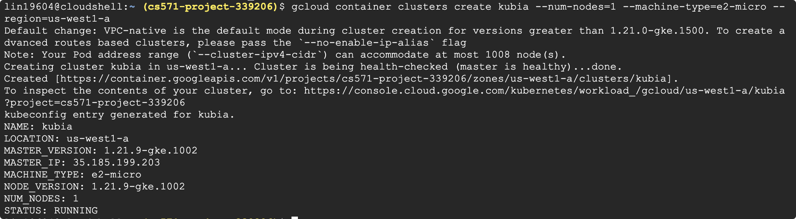

# Signature Project - MongoDB + Python Flask Web Framework + REST API + GKE

# Step 1 Create MongoDB using Persistent Volume on GKE, and insert records into it

1. Create a cluster

```bash
gcloud container clusters create kubia --num-nodes=1 --machine-type=e2-micro --region=us-west1-a
```



1. Create a Persistent Volume

```bash
gcloud compute disks create --size=10GiB --zone=us-west1-a mongodb
```


1. Create mongodb-deployment.yaml

```yaml
apiVersion: apps/v1
kind: Deployment
metadata:
  name: mongodb-deployment
spec:
  selector:
    matchLabels:
     app: mongodb
  strategy:
    type: Recreate
  template:
    metadata:
      labels:
        app: mongodb
    spec:
      containers:
        - image: mongo
          name: mongo
          ports:
            - containerPort: 27017
          volumeMounts:
            - name: mongodb-data
              mountPath: /data/db
      volumes:
        - name: mongodb-data
          gcePersistentDisk:
            pdName: mongodb
            fsType: ext4
```

```bash
vim mongodb-deployment.yaml
kubectl create -f mongodb-deployment.yaml
kubectl get pods
```


1. Create mongo-service.yaml

```yaml
apiVersion: v1
kind: Service
metadata:
  name: mongodb-service
spec:
  type: LoadBalancer
  ports:
    - port: 27017
      targetPort: 27017
  selector:
    app: mongodb
```

```bash
vim mongodb-service.yaml
kubectl create -f mongo-service.yaml
kubectl get svc
```


1. Try to connect MongoDB

```bash
kubectl exec -it mongodb-deployment-57dc68b4bd-68pmb -- bash
mongo 35.199.163.111
```


1. Insert records in MongoDB

```bash
use studentdb
db.students.insert({ student_id: 11111, student_name: "Bruce Lee", grade: 84})
db.students.insert({ student_id: 22222, student_name: "Jackie Chen", grade: 93 })
db.students.insert({ student_id: 33333, student_name: "Jet Li", grade: 88})
db.students.find()
```


# Step 2 Modify our studentServer to get records from MongoDB and deploy to GKE

1. Create studentServer.js

```jsx
var http = require('http');
var url = require('url');
var mongodb = require('mongodb');
const {
  MONGO_URL,
  MONGO_DATABASE
} = process.env;

var MongoClient = mongodb.MongoClient;
var uri = `mongodb://${MONGO_URL}/${MONGO_DATABASE}`;
console.log(uri);

var server = http.createServer(function (req, res) {
  var result;
  // req.url = /api/score?student_id=11111
  var parsedUrl = url.parse(req.url, true);
  var student_id = parseInt(parsedUrl.query.student_id);
  // match req.url with the string /api/score
  if (/^\/api\/score/.test(req.url)) {
    // e.g., of student_id 1111
    MongoClient.connect(uri,{ useNewUrlParser: true, useUnifiedTopology:
    true }, function(err, client){
      if (err)
        throw err;
      var db = client.db("studentdb");
      db.collection("students").findOne({"student_id":student_id},
      (err, student) => {
        if(err)
          throw new Error(err.message, null);
        if (student) {
          res.writeHead(200, { 'Content-Type': 'application/json'
        })
          res.end(JSON.stringify(student)+ '\n')
        } else {
          res.writeHead(404);
          res.end("Student Not Found \n");
        }
      });
    });
  } else {
    res.writeHead(404);
    res.end("Wrong url, please try again\n");
  }
});
server.listen(8080);
```

1. Create Dockerfile

```docker
FROM node:14
ADD studentServer.js /studentServer.js
RUN npm install mongodb
ENTRYPOINT ["node", "studentServer.js"]
```

1. Build docker image

```bash
docker build -t blueandhack/studentserver .
```


1. Push to docker hub

```bash
docker push blueandhack/studentserver
```


# Step 3 Create a python Flask bookshelf REST API and deploy on GKE

1. Create Python bookshelf.py

```python
from flask import Flask, request, jsonify
from flask_pymongo import PyMongo
from flask import request
from bson.objectid import ObjectId
import socket
import os

app = Flask(__name__)
app.config["MONGO_URI"] = "mongodb://"+os.getenv("MONGO_URL")+"/"+os.getenv("MONGO_DATABASE")
app.config['JSONIFY_PRETTYPRINT_REGULAR'] = True
mongo = PyMongo(app)
db = mongo.db

@app.route("/")
def index():
  hostname = socket.gethostname()
  return jsonify(
    message="Welcome to bookshelf app! I am running inside {} pod!".format(hostname)
  )

@app.route("/books")
def get_all_tasks():
  books = db.bookshelf.find()
  data = []
  for book in books:
    data.append({
    "id": str(book["_id"]),
    "Book Name": book["book_name"],
    "Book Author": book["book_author"],
    "ISBN" : book["ISBN"]
    })
  return jsonify(data)

@app.route("/book", methods=["POST"])
def add_book():
  book = request.get_json(force=True)
  db.bookshelf.insert_one({
    "book_name": book["book_name"],
    "book_author": book["book_author"],
    "ISBN": book["isbn"]
  })
  return jsonify(message="Task saved successfully!")

@app.route("/book/<id>", methods=["PUT"])
def update_book(id):
  data = request.get_json(force=True)
  print(data)
  response = db.bookshelf.update_many({"_id": ObjectId(id)}, {"$set":
  {"book_name": data['book_name'],
  "book_author": data["book_author"], "ISBN": data["isbn"]
  }})
  if response.matched_count:
    message = "Task updated successfully!"
  else:
    message = "No book found!"
  return jsonify(message=message)

@app.route("/book/<id>", methods=["DELETE"])
def delete_task(id):
  response = db.bookshelf.delete_one({"_id": ObjectId(id)})
  if response.deleted_count:
    message = "Task deleted successfully!"
  else:
    message = "No book found!"
  return jsonify(message=message)

@app.route("/tasks/delete", methods=["POST"])
def delete_all_tasks():
  db.bookshelf.remove()
  return jsonify(message="All Books deleted!")

if __name__ == "__main__":
  app.run(host="0.0.0.0", port=5000)
```

1. Create Dockerfile

```docker
FROM python:alpine3.7
ADD bookshelf.py /bookshelf.py
RUN pip3 install flask flask_pymongo
ENV PORT 5000
EXPOSE 5000
ENTRYPOINT ["python3"]
cmd [ "bookshelf.py" ]
```

1. Build bookshelf app and push it to docker hub

```bash
docker build -t blueandhack/bookshelf .
docker push blueandhack/bookshelf
```


# Step 4 Create ConfigMap for both applications to store MongoDB URL and MongoDB name

1. Create studentserver-configmap.yaml

```yaml
apiVersion: v1
kind: ConfigMap
metadata:
  name: studentserver-config
data:
  MONGO_URL: 35.199.163.111
  MONGO_DATABASE: mydb
```

```bash
vim studentserver-configmap.yaml
kubectl create -f studentserver-configmap.yaml
```


1. Create bookshelf-configmap.yaml

```yaml
apiVersion: v1
kind: ConfigMap
metadata:
  name: bookshelf-config
data:
  MONGO_URL: 35.199.163.111
  MONGO_DATABASE: mydb
```

```bash
vim bookshelf-configmap.yaml
kubectl create -f bookshelf-configmap.yaml
```


# Step 5 Expose 2 application using ingress with Nginx, so we can put them on the same Domain but different PATH

1. Create studentserver-deployment.yaml

```yaml
apiVersion: apps/v1
kind: Deployment
metadata:
  name: studentserver-deployment
  labels:
    app: studentserver-deployment
spec:
  replicas: 1
  selector:
    matchLabels:
     app: studentserver-deployment
  template:
    metadata:
      labels:
        app: studentserver-deployment
    spec:
      containers:
        - image: blueandhack/studentserver
          imagePullPolicy: Always
          name: studentserver-deployment
          ports:
            - containerPort: 8080
          env:
            - name: MONGO_URL
              valueFrom:
                configMapKeyRef:
                  name: studentserver-config
                  key: MONGO_URL
            - name: MONGO_DATABASE
              valueFrom:
                configMapKeyRef:
                  name: studentserver-config
                  key: MONGO_DATABASE
```

1. Create studentserver-service.yaml

```yaml
apiVersion: v1
kind: Service
metadata:
  name: studentserver-service
spec:
  type: NodePort
  ports:
    - port: 8080
      targetPort: 8080
  selector:
    app: studentserver-deployment
```

1. Create bookshelf-deployment.yaml

```yaml
apiVersion: apps/v1
kind: Deployment
metadata:
  name: bookshelf-deployment
  labels:
    app: bookshelf-deployment
spec:
  replicas: 1
  selector:
    matchLabels:
     app: bookshelf-deployment
  template:
    metadata:
      labels:
        app: bookshelf-deployment
    spec:
      containers:
        - image: blueandhack/bookshelf
          imagePullPolicy: Always
          name: bookshelf-deployment
          ports:
            - containerPort: 5000
          env:
            - name: MONGO_URL
              valueFrom:
                configMapKeyRef:
                  name: bookshelf-config
                  key: MONGO_URL
            - name: MONGO_DATABASE
              valueFrom:
                configMapKeyRef:
                  name: bookshelf-config
                  key: MONGO_DATABASE
```

1. Create bookshelf-service.yaml

```yaml
apiVersion: v1
kind: Service
metadata:
  name: bookshelf-service
spec:
  type: NodePort
  ports:
    - port: 5000
      targetPort: 5000
  selector:
    app: bookshelf-deployment
```

1. Start minikube

```bash
minikube start
```


1. Enable ingress

```bash
minikube addons enable ingress
```


1. Create studentserver related pods and start service using the above yaml file

```bash
kubectl apply -f studentserver-deployment.yaml
kubectl apply -f studentserver-configmap.yaml
kubectl apply -f studentserver-service.yaml
```


1. Create bookshelf related pods and start service using the above yaml file

```bash
kubectl apply -f bookshelf-deployment.yaml
kubectl apply -f bookshelf-configmap.yaml
kubectl apply -f bookshelf-service.yaml
```


1. Check pods

```bash
kubectl get pods
```


1. Create ingress studentservermongoIngress.yaml

```yaml
apiVersion: networking.k8s.io/v1
kind: Ingress
metadata:
  name: kubia-ingress
  annotations:
    nginx.ingress.kubernetes.io/rewrite-target: /$2
spec:
  rules:
  - host: cs571.project.com
    http:
      paths:
      - path: /studentserver(/|$)(.*)
        pathType: Prefix
        backend:
          service:
            name: studentserver-service
            port:
              number: 8080
      - path: /bookshelf(/|$)(.*)
        pathType: Prefix
        backend:
          service:
            name: bookshelf-service
            port:
              number: 5000
```

```bash
kubectl apply -f studentservermongoIngress.yaml
```


1. Check ingress status

```bash
kubectl get ingress
```


1. Edit hosts

```bash
sudo vim /etc/hosts

# ip-address cs571.project.com
192.168.49.2 cs571.project.com
```


1. Try to access api

```bash
curl cs571.project.com/studentserver/api/score?student_id=11111
```


For bookshelf add book first

```bash
curl -X POST -d "{\"book_name\": \"cloud computing\",\"book_author\": \"unkown\", \"isbn\": \"123456\" }" http://cs571.project.com/bookshelf/book
```

```bash
curl cs571.project.com/bookshelf/books
```


Update book

```bash
curl -X PUT -d "{\"book_name\": \"123\",\"book_author\": \"test\", \"isbn\": \"123updated\" }" http://cs571.project.com/bookshelf/book/624418297c7ddf66c5f3efd7
```


Delete book

```bash
curl -X DELETE cs571.project.com/bookshelf/book/624418297c7ddf66c5f3efd7
```


# GitHub

[https://github.com/blueandhack/K8S-Python-Node-GKE](https://github.com/blueandhack/K8S-Python-Node-GKE)

# Slides

Google Slides [https://docs.google.com/presentation/d/1njtM-Dgt4jZXIEnnYx2EzCQhiKbCX-BHr9riWzK-SFQ/edit?usp=sharing](https://docs.google.com/presentation/d/1njtM-Dgt4jZXIEnnYx2EzCQhiKbCX-BHr9riWzK-SFQ/edit?usp=sharing)